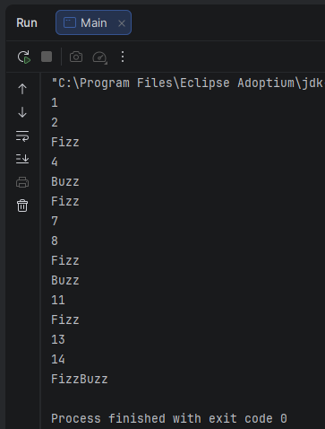
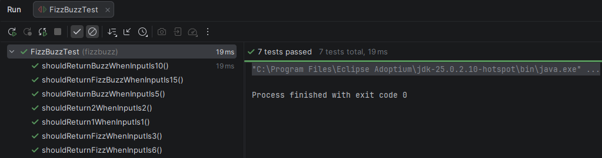

# 🧪 FizzBuzz Kata — TDD con Java

<p align="center">
  
  
  
  
  
</p>

---

## 📘 Descripción

Este proyecto implementa la kata clásica **FizzBuzz** en Java aplicando **TDD (Test-Driven Development)**.

Las reglas de funcionamiento son:

- múltiplo de 3 => Fizz
- múltiplo de 5 => Buzz
- múltiplo de 3 y 5 => FizzBuzz
- cualquier otro caso => número como texto

---

## 🎯 Objetivo del ejercicio

El objetivo de este ejercicio es practicar el ciclo de trabajo de **TDD: Red → Green → Refactor**:

1. escribir un test
2. ejecutar y ver fallar
3. implementar el mínimo código necesario
4. ejecutar de nuevo hasta pasar
5. refactorizar si procede

---

## 🛠️ Tecnologías utilizadas

- Java 25
- Maven
- JUnit 5
- IntelliJ IDEA
- Git
- GitHub

---

## 🗂️ Estructura del proyecto

```text
fizzbuzz
├── img
│   ├── FizzBuzzPantalla.png
│   └── FizzBuzzTest.png
├── src
│   ├── main
│   │   ├── java
│   │   │   └── org.example
│   │   │       └── Main.java
│   │   └── resources
│   └── test
│       └── java
│           └── fizzbuzz
│               └── FizzBuzzTest.java
├── pom.xml
└── README.md
```

---

## 📋 Reglas de funcionamiento

| Entrada | Salida |
|---------|--------|
| 1 | `1` |
| 2 | `2` |
| 3 | `Fizz` |
| 5 | `Buzz` |
| 6 | `Fizz` |
| 10 | `Buzz` |
| 15 | `FizzBuzz` |

---

## 🧠 Lógica implementada

La función evalúa cada número en este orden:

1. múltiplo de 3 y 5 → FizzBuzz
2. múltiplo de 3 → Fizz
3. múltiplo de 5 → Buzz
4. resto → número como texto

Este orden es importante para que `15` no devuelva solo `Fizz` o `Buzz`.

---

## ▶️ Ejecución del programa

La clase `Main` imprime por consola la secuencia del 1 al 15:

```text
1
2
Fizz
4
Buzz
Fizz
7
8
Fizz
Buzz
11
Fizz
13
14
FizzBuzz
```



---

## ✅ Tests

El proyecto incluye pruebas unitarias con **JUnit 5**.

Casos cubiertos:

- retorno del número como texto
- retorno de Fizz para múltiplos de 3
- retorno de Buzz para múltiplos de 5
- retorno de FizzBuzz para múltiplos de 3 y 5



---

## 🔁 Proceso TDD seguido

- `1 -> "1"`
- `2 -> "2"`
- `3 -> "Fizz"`
- `6 -> "Fizz"`
- `5 -> "Buzz"`
- `10 -> "Buzz"`
- `15 -> "FizzBuzz"`

---

## 🚀 Cómo ejecutar el proyecto

### 🧪 Ejecutar tests

Se pueden ejecutar desde **IntelliJ IDEA** o usando **Maven**:

```bash
mvn test
```

### ▶️ Ejecutar la aplicación

La aplicación se ejecuta lanzando la clase `Main.java`.

---

## 👨‍💻 Autor

**David Navarro**
Proyecto realizado como práctica de Testing TDD con Java usando la kata FizzBuzz.
